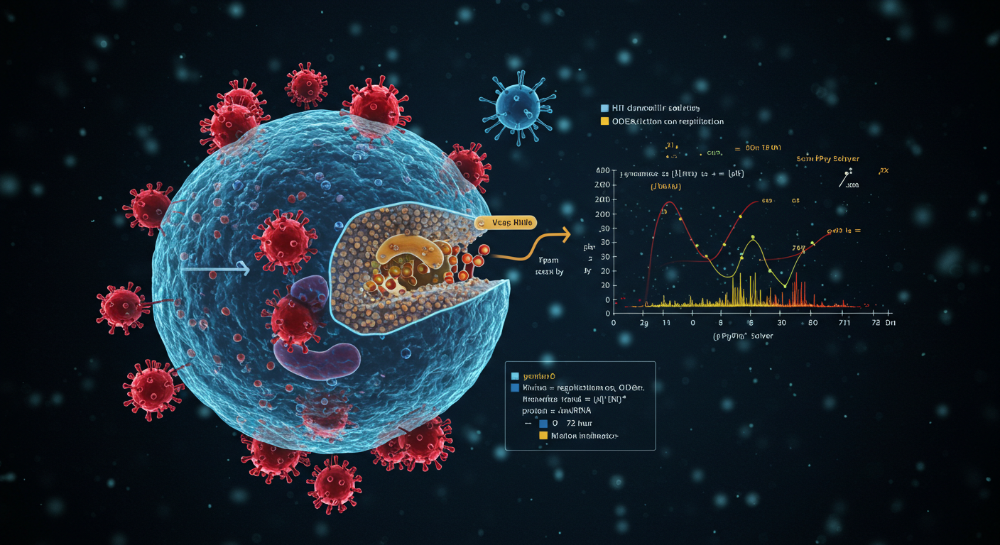
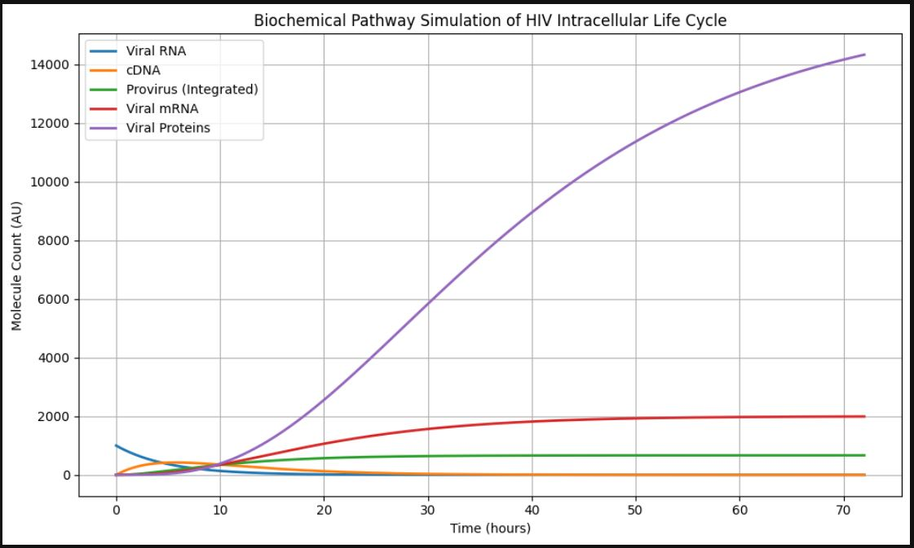

# Biochemical-Pathway-Simulation-in-HIV-Virus

## Overview

This project simulates the intracellular replication cycle of the HIV virus using a system of biochemical ordinary differential equations (ODEs). By modeling key molecular species (Viral RNA, cDNA, Provirus, Viral mRNA, and Viral Proteins) and their kinetic interactions, the project provides insights into HIV dynamics, supporting antiviral drug discovery. Implemented in Python, it leverages numerical integration and visualization to analyze viral replication over 72 hours, aligning with my portfolio’s focus on AI-driven antiviral solutions.

**Key Features**

•	ODE-Based Simulation: Models HIV replication with five coupled ODEs representing biochemical pathways.

•	Kinetic Parameters: Configurable rates for reverse transcription, integration, transcription, translation, and degradation.

•	Time-Series Analysis: Tracks molecule counts over 72 hours with 500 time points.

•	Visualization: Generates clear plots of molecular species dynamics, saved as hiv_pathway_simulation.png.

•	Reproducible Code: Structured Jupyter Notebook with modular functions for easy extension.

## Step-by-Step Workflow

**1.	Define ODE System:** Implement hiv_model function with five ODEs for Viral RNA, cDNA, Provirus, Viral mRNA, and Proteins, based on kinetic parameters (e.g., k1 = 0.2 for reverse transcription).

**2.	Set Initial Conditions:** Start with 1000 Viral RNA molecules and zero for others (y0 = [1000, 0, 0, 0, 0]).

**3.	Configure Parameters:** Define rates (e.g., k4 = 0.3 for transcription, k_deg_mRNA = 0.1 for mRNA degradation).

**4.	Solve ODEs:** Use scipy.integrate.odeint to numerically solve the system over 72 hours.

**5.	Visualize Results:** Plot molecule counts vs. time using Matplotlib, with a legend and grid, saved as a PNG.

**6.	Analyze Dynamics:** Interpret trends, e.g., rapid RNA decline, cDNA peak, and steady Provirus growth.

**Demo Results**

Sample molecule counts at key time points (full results in the notebook):

| Time (hours) | Viral RNA | cDNA   | Provirus | Viral mRNA | Proteins |
|--------------|-----------|--------|----------|------------|----------|
| 0            | 1000.00   | 0.00   | 0.00     | 0.00       | 0.00     |
| 24           | 88.20     | 283.14 | 409.86   | 122.96     | 295.09   |
| 48           | 7.78      | 112.45 | 614.55   | 184.37     | 663.74   |
| 72           | 0.69      | 44.67  | 716.53   | 214.96     | 1032.73  |

**•	Viral RNA:** Declines exponentially due to reverse transcription.

**•	cDNA:** Peaks early, then decreases as it integrates into Provirus.

**•	Provirus:** Steadily accumulates, driving mRNA production.

**•	Viral mRNA/Proteins:** Increase over time, reflecting active transcription/translation.

## Relevance to Industry and Humanity

**•	Industry:** Informs pharmaceutical R&D by modeling HIV replication dynamics, aiding the design of reverse transcriptase and integrase inhibitors. Supports virtual screening for antiviral drugs, reducing experimental costs.

**•	Humanity:** Advances HIV treatment strategies, improving outcomes for millions living with HIV/AIDS. Enhances understanding of viral persistence, critical for developing functional cures.

## Demo Visualizations

**•	HIV Pathway Plot (hiv_pathway_simulation.png):** Time-series plot of all molecular species, showing RNA decay, cDNA transient peak, and Protein accumulation.

•	Use Case: Visualizes drug target points (e.g., inhibiting k1 to block cDNA formation).

## Technologies Used

•	Python 3: Core programming language.

•	NumPy: Array operations for ODE inputs.

•	SciPy: ODE integration with odeint.

•	Matplotlib: Plotting and visualization.

•	Jupyter Notebook: Interactive development and documentation.

## Why This Project Matters
This project showcases my expertise in computational biology and antiviral research, integrating mathematical modeling with Python programming. By simulating HIV’s biochemical pathways, it demonstrates my ability to tackle complex biological systems, aligning with my portfolio’s focus on AI-driven antiviral solutions. The reproducible code and clear visualizations highlight my skills in delivering actionable insights for pharmaceutical innovation.

## License
MIT License. See LICENSE for details.
________________________________________
For full details, view the Jupyter Notebook in the GitHub repository.

